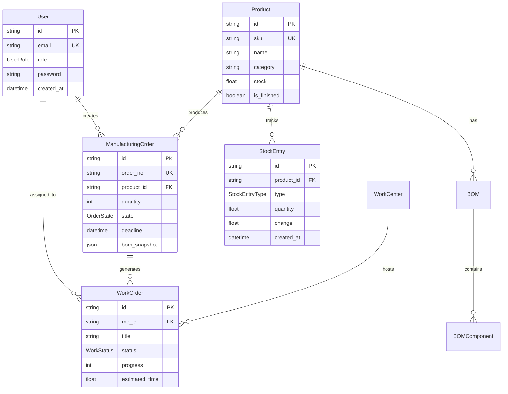

# ManufactureOS — From Order To Output, In One Flow

**Team Name:** Fullmetal Hackmists

## Team Members
1. Shashank Padanad
2. Ishan Gupta
3. Maurya C R
4. Mohit Patil

Modern manufacturing management system built with Next.js 14 App Router. It covers orders, BOMs, work centers, work orders, inventory, analytics, and real‑time ops visibility.

## Demo video
- Watch: https://drive.google.com/file/d/1cso4_JsF3ckYW_GVsL8vayRPzzBS-Aam/view?usp=sharing

## Highlights
- Role‑based auth (ADMIN, MANAGER, OPERATOR, INVENTORY) via NextAuth Credentials
- App Router APIs for analytics, admin, stock, and reports
- Real‑time updates using Socket.IO (rooms per role, user, WO, MO)
- Inventory with ledger entries, IN/OUT typing, balanceAfter, and low‑stock alerts
- BOMs (legacy components + new items) and MO workflows with routing helpers
- Hardened security: CSP, auth middleware, CSRF checks, strict cookies, headers

## Tech Stack
- Next.js 14 (App Router) + React 18
- Prisma ORM + PostgreSQL
- NextAuth.js (credentials provider) + PrismaAdapter
- Tailwind CSS + shadcn/ui + Radix primitives
- Socket.IO for real‑time
- Zod, date-fns, XLSX, pdfkit (PDF), sonner, lucide-react

## 📊 Entity Relationship Overview



## Quick Start (Windows PowerShell)
1) Prereqs
- Node.js 18+ and pnpm or npm
- PostgreSQL (local or hosted)

2) Configure environment
- Copy `.env.example` to `.env.local` (or `.env`) and set DATABASE_URL and NEXTAUTH_SECRET

3) Install deps
```powershell
pnpm install
# or
npm install
```

4) Setup database
```powershell
npm run db:generate
npm run db:migrate
npm run db:seed
```

5) Run the app
```powershell
npm run dev
```
Open http://localhost:3000

Demo accounts after seeding:
- Admin: admin@demo.com / Admin@123
- Manager: manager@demo.com / Manager@123
- Operator: operator1@demo.com / Operator@123
- Inventory: inventory@demo.com / Inventory@123

## Scripts
- dev: start Next.js dev server
- build: production build
- start: start production server
- lint: Next lint
- db:generate: prisma generate
- db:migrate: prisma migrate dev
- db:seed: ts-node prisma/seed.ts

## Environment
Defined in `.env.example`:
- DATABASE_URL=postgresql://… (required)
- NEXTAUTH_SECRET=long-random-string (required)
- NEXTAUTH_URL=http://localhost:3000 (dev)

## Database & Models
See `prisma/schema.prisma` for full schema. Key models:
- User (role: ADMIN | MANAGER | OPERATOR | INVENTORY)
- Product (finished/raw, minStockAlert, stockEntries)
- BOM (legacy components + new items)
- ManufacturingOrder (orderNo, quantity, state)
- WorkOrder (status, progress, times, workCenter, assignedTo)
- WorkCenter (status, capacity, cost)
- StockEntry (type IN/OUT, quantity, change, balanceAfter)

Seed script (`prisma/seed.ts`) generates users, work centers, 150 raw materials (with initial stock), 50 finished goods with BOMs, and 200 manufacturing orders with work orders.

## Auth & Security
Implemented in `pages/api/auth/[...nextauth].ts` with credential logins and bcrypt hashing. Security hardening:
- Global middleware (`middleware.ts`) enforces auth, admin-only routes, and CSRF same‑origin for mutating API calls
- Strict cookies and JWT sessions; cookie names switch to __Secure‑ prefix in prod
- Content‑Security‑Policy and other headers are set on all requests
- Server guards (`lib/server-auth.ts`, `lib/auth.ts`, `lib/api-guard.ts`)

Admin step‑up reauth endpoint currently disabled (`app/api/admin/reauth/route.ts` returns 404); middleware checks ADMIN role for `/admin` and `/api/admin/*`.

## Real‑time (Socket.IO)
- Server entry: `pages/api/socketio.ts` (Socket.IO attached to Next API server)
- Client hook/provider: `hooks/use-socket.ts`, `components/socket-provider.tsx`
- Rooms: `role:{ROLE}`, `user:{ID}`, `dashboard`; subscribe to `workorder:{id}`, `mo:{id}`
- Emitters: `lib/socket.ts` centralizes events like workorder:started/completed, mo:updated, stock:low_stock_alert

## Inventory & Stock
Core helpers in `lib/stock.ts`:
- getCurrentStock(productId), createStockEntry, processStockOperations
- consumeStockForMO(moId) — consumes BOM materials (OUT) and adds finished goods (IN)
- manualStockAdjustment(productId, adjustment, reason, userId)

Endpoints (examples):
- GET `/api/stock/low` — low‑stock list
- POST `/pages/api/stock/manual` — manual adjustment

## Reports
- GET `/api/reports/template` — Excel template
- POST `/api/reports/upload` — import .xlsx/.xls (PDF acknowledged)

## Admin
- UI at `/admin` (stats, lists). APIs under `/app/api/admin/*`

## Frontend Routes
- `/` redirect logic to `/landing` or `/dashboard`
- `/auth`, `/signup`, `/dashboard`, `/work-orders`, `/work-centers`, `/stock-ledger`, `/bom`, `/reports`, `/admin/*`

## Troubleshooting
- Dev server fails to start: check env, DB accessible, run migrate/seed, then `npm run dev`
- Prisma type mismatches: `npm run db:generate` then restart TypeScript server
- Socket.IO not connecting: ensure API route initialized and user is authenticated


